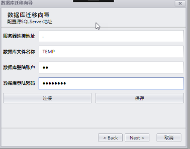
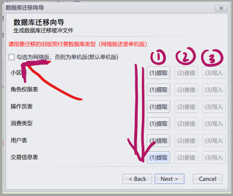
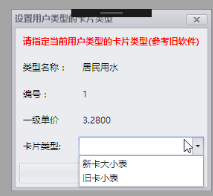

============
系统维护
============

客户端安装
-----------

许可证工具使用
~~~~~~~~~~~~~~~

解压许可证授权工具后，你将得到如下文件

.. figure:: img/keytool1.png

找到''**激活码生成工具.exe**'' 打开，将弹出如下界面

.. figure:: img/keytool2.png

参数介绍

.. list-table::

    * - 参数名称
      - 作用
      - 备注
    * - PID
      - 客户代码，错误的PID可能导致卡片无法解密，系统会使用PID加密卡片，不同的客户对应不同的PID
      - 表厂给水司分配的ID，不同水司不可互读
    * - 客户名称
      - 水司名称
      - 水司的公司名称    
    * - 客户编号
      - 给水司的编号
      - 无实际意义
    * - 注册日期
      - 动态库启用时间
      - 在这个日期前动态库将不可使用
    * - 结束日期
      - 动态库停用时间
      - 在这个事件之后动态库将被禁用
    * - 开发时间
      - 阀门开启的时间
      - 无实际意义
    * - 关阀时间
      - 阀门关闭的时间
      - 无实际意义

配置完成后

将此许可证发给水司使用即可。

.. note::
    - 一家自来水公司使用一个许可证文件即可，对于同一个自来水公司只要保证PID值唯一即可。
    - 错误的PID可能导致卡片无法解密。更会导致卡片报废。 

软件配置
~~~~~~~~~~~~~~~

数据库安装
------------

由于预付费水表管理系统是基于数据库执行任务存储结果的，所以您在使用时，必须先建议数据库存储来保存你的记录信息

联网版 SQl Server数据库
~~~~~~~~~~~~~~~

这里以SQl Server2012为例来安装数据库引擎。

..  note::
    - SqlServer 数据库分为 数据库引擎和 SQlServer Management Studio的。数据库引擎商用是需要授权的，而SQlServer Management Studio 是免费的。
    - SQlServer Management Studio 你可以在如下网址获取.https://docs.microsoft.com/zh-CN/sql/ssms/download-sql-server-management-studio-ssms?view=sql-server-2017,数据库管理工具是独立的个体，任意版本都是可以的。
    - 关于SqlServer的安装你可以参考本文也可以自行去互联网搜索。由于文档更新可能不及时，您使用的版本可能并非本文所介绍的。

好了下面进入正文

   ** 第一步：下载**
        下载地址:https://www.microsoft.com/zh-cn/download/details.aspx?id=29066

        .. figure:: img/sql1.png

        紧接着选择你要的数据库引擎

        .. figure:: img/sql2.png

        新建一个文件夹，把下载后的三个安装包放在同一个目录下

        .. figure:: img/sql3.png

        ..  note::
            - 部分浏览器可能存在兼容问题，如遇访问不畅，请尝试更换浏览器

    ** 第二步：安装**   

        双击可执行文件SQLFULL_x64_CHS_Install.exe，解压完成后会在当前目录下生成一个新的文件夹

        .. figure:: img/sql4.png

        进入文件夹，执行文件SETUP.EXE启动安装

        .. figure:: img/sql5.png

        进入安装导航

        .. figure:: img/sql6.png

        安装 >>> 全新SQL Server安装（特殊需要根据情况自行选择）

        .. figure:: img/sql7.png

        安装程序支持规则 >>> 确定

        .. figure:: img/sql8.png

        选择版本 OR 输入产品秘钥 >>> 确定

        .. figure:: img/sql9.png

        ..  note::
            - 产品密钥：https://www.cnblogs.com/luckyting/articles/6872374.html
            - 如上连接无法保证永久可用

        接受条款 >>> 下一步

        .. figure:: img/sql10.png

        ..  note::
            - 如果点击下一步之后，出现提示无法更新的提示信息，请参考 https://blog.csdn.net/qqj3066574300/article/details/83821100
        
        没有无法更新的提示或已经解决问题，继续下一步

        .. figure:: img/sql11.png

        安装SQL Server安装程序，保持网络畅通，耐心等待

        .. figure:: img/sql12.png

        所有状态都显示完成后，下一步

        .. figure:: img/sql13.png

        设置角色 >>> 下一步

        .. figure:: img/sql14.png

        选择功能（不确定就全选） >>> 指定目录（不确定就默认） >>> 下一步

        .. figure:: img/sql15.png

        实例配置：默认实例 >>> 下一步

        .. figure:: img/sql16.png

        下一步，下一步，到数据库引擎配置 **重要** 

        建议混合模式，设置数据库密码，添加当前用户 >>> 下一步

        .. figure:: img/sql17.png

        添加当前用户 >>> 下一步
        
        .. figure:: img/sql18.png

        下一步

        .. figure:: img/sql19.png

        添加当前用户 >>> 下一步

        .. figure:: img/sql20.png

        取名 >>> 下一步

        .. figure:: img/sql21.png

        下一步

        .. figure:: img/sql22.png

        全通过 >>> 下一步

        .. figure:: img/sql23.png

        安装

        .. figure:: img/sql24.png

        【完成】 >>> 关闭

        .. figure:: img/sql25.png

单机版 SQLCE数据库
~~~~~~~~~~~~~~~

单机版数据库不需要安装，启动后数据库会被自动创建。创建位置为

    C:\\Users\\{用户名}\\Documents\\MeterSystem\\SQLCEDB.sdf

..  note::
    - 即使你使用的是网络版该文件也有可能出现
    - Patch.sdf文件是一个临时的报表文件，任何情况下您都可以直接删除它，不会影响程序的稳定性
    - Keys.bin文件是许可证文件的直接完整备份。如果要迁移该文件可直接复制给客户端，免去重新颁发许可证的步骤
    - 单机版数据库是不需要配置连接字符串的。因为这个地址是固定的。

数据库迁移
------------

由于旧版的系统是使用deplin 开发，目前国内已经很少有人使用，对应的开发人员也很难找，其次旧版系统存在很多弊病，从代码层面已经很难维护，故而对于新接的需求我们都是建议客户升级为二代收费系统的。

一代升级二代
~~~~~~~~~~~~~~~

该功能是将第一代的预付费水表管理系统升级为第二代。整体迁移思路活动图如下

    .. figure:: img/brain1.png

.. note ::
    - 无论旧版是一代单机版还是一代网络版 都可以升级为二代单机或者网络版

对于单机数据库，由于旧版预付费水表管理系统对数据库做了加密处理，故而再迁移前我们需要先对数据库做解密处理。见下文

Access数据库解密步骤
^^^^^^^^^^^^^^^^^^

    * 打开数据库工具界面如下

    .. figure:: img/dbtool6.png
    
    * 导数据之前必须先配置目标数据库，如下图并指定要目标数据库类型，目前支持的数据库类型有SQLCE（单机数据库）、SQL Server 。单击生效

    .. figure:: img/dbtool7.png

    .. note::
        - MYSQL已在新版中删除

    * 指定好数据库类型后根据对应的数据库配置好对应的 *服务器连接地址*、*数据库文件名称*、“数据库登陆账户”、“数据库登陆密码”,然后单击“连接”并“保存”，最后单击“初始化数据库”,数据库迁移前必须先初始化目标数据库，并保证在迁移数据库启动一次预付费系统（系统会加载卡片类型，写入本地数据库）。

    * 数据库初始化完成后，请单击“数据库迁移”按钮，接下来进行数据库迁移工作

    .. note::
      - 迁移前请仔细阅读注意事项
    
    .. figure:: img/dbtool8.png

    * 单击“下一步”，开始解密，单击“打开”，加载Access源数据库文件，单号单击解密，数据库文件便会被解密（如果是网络版数据库，请直接跳过此步骤）

    .. figure:: img/dbtool9.png

Access数据库导入到SQl Server
^^^^^^^^^^^^^^^^^^^^^^^^^^^

..  note::
    - 此操作仅适用于单机版ACCESS数据库,如果是网络版数据库，请直接跳过此操作

**具体步骤**

    * 打开SQL Server Management  Studio，并登录，这里以SQL Server 2012为例

    .. figure:: img/SqlServer20121.png

    * 右键单击当前连接的数据库，并单击 *新建数据库* 

    .. figure:: img/SqlServer20122.png

    * 选中 *常规* 选项卡，并在数据库名称内填入一个临时的数据库名称，这里以TEMP为例单击 *确定* 完成创建

    .. note::
        - 数据导入完成后请删除该数据库
    
    .. figure:: img/SqlServer20123.png

    * 数据库创建完成后，右键单击刚才创建的数据库，任务，然后单击 *导入数据* 

    .. figure:: img/SqlServer20124.png

    * 在弹出的 *SQL Server 导入和导出向导* 界面单击 *下一步*

    .. figure:: img/SqlServer20125.png

    * 将界面切换到选择数据源界面，如下

    .. figure:: img/SqlServer20126.png

    * 在选择源界面，选择数据源类型为 *Microsoft  Access(Microsoft Access Database Engine)* 然后单击 *浏览* 按钮加载之前解密后的Access数据库文件。
    
    .. note::
        - 用户名和密码不填写
    
    * 单击 *下一步* 界面将导航至目标数据库界面

    .. figure:: img/SqlServer20127.png

    * 在目标数据库界面,选择目标数据库类型为 *SQL Server Native Client* 然后将服务器名称、身份验证方式填好
    
    .. note::
        - 远程数据库身份验证方式需要填写用户名和密码，windows身份验证不需要

    * 单击 *下一步*

    .. figure:: img/SqlServer20128.png

    * 在指定表复制和插件页面，选择 *复制一个或多个表或视图的数据* ，然后单击 *下一步* 

    .. figure:: img/SqlServer20129.png

    * 将所有表全部勾选，然后单击 *下一步*

    .. figure:: img/SqlServer201210.png

    * 在弹出上图界面后单击 *完成*
    
    .. figure:: img/SqlServer201211.png

    * 单击 *关闭* 完成数据传输操作

从SQL Server 导入到最终用户数据库
^^^^^^^^^^^^^^^^^^^^^^^^^^^

在数据传输完成后，请切换到数据库迁移向导

.. note::
    - 请注意：这里填写的是要 导出的数据库，对于单机版就是临时数据库，对于网络版就是旧版目前使用的数据库地址

在上图填写好数据库连接信息（之前Access导入到SQL Server 数据库），单击 *连接* 测试连接字符串，单击 *保存* 保存连接信息，然后单击 *NEXT* 

.. note::
    - 如果是网络版请勾选选上面的复选框，否则为单机版

在紧接的界面中（上图）依照箭头指向，从左到右、从上而下逐个操作.

.. note::
    - 此处顺序非常重要.

在迁移消费类型表时，需要知道对应的消费类型，切记不可弄错 见下图

..  note::
    - 新卡大小表是大表，旧卡小表示小口径的
    - 若弹出消息框“用户表下的小区ID在小区ID表中不存在，小区ID：{ID}”，则说明小区表 *TB_RESIDEAREA* 源数据库再用用户表内不存在，请自定根据情况在表 *TD_CONSUMER* 或 *TB_RESIDEAREA* 表内修改数据
    - 若弹出消息框“用户表下的消费类型ID在消费类型表下不存在，ID值{ID}”，则说明用表下第ID行的数据在表 *TB_CONSUMER_TYPE* 中不存在.请自定情况在 *TD_CONSUMER*或 *TB_CONSUMER_TYPE* 表内修改数据
    - 一般*TD_CONSUMER*表出现错误可能性会比较大
    - 例如认为将一个消费类型ID为3的数据写入数据库，但是在表 *TB_CONSUMER_TYPE* 中并不存在该消费类型，这样便无法继续迁移数据了

二代单机版升级二代网络版
~~~~~~~~~~~~~~~

.. note::
    - 该迁移功能只针对SqlCe单机版数据库可使用

详细操作

    打开数据库工具

    首先选择SqlServer数据库，填写数据库连接字符串，连接->保存->数据库初始化 
    
    .. figure:: img/dbtool1.png

    初始化完成后，选择SqlCe数据库
    
    .. figure:: img/dbtool2.png

    点击【数据库单机转网络】按钮

    填写上步完成初始化的数据库连接字符串，连接并且保存，点击下一步 

    .. figure:: img/dbtool3.png     

    .. figure:: img/dbtool4.png

    这里逐表进行数据迁移。先读取再写入

    .. figure:: img/dbtool5.png

    第七步无问题操作完成后,将数据库工具的数据库类型改成SQLServer。因为在迁移的时候，我们是以SqlCe来迁移的。

    重新打开预付费水表管理系统。重新分配权限，即可查看到数据已经迁移完成.

.. note::

    如果某一步骤由于网络原因出错，请直接重试该步骤即可，迁移为差异复制，相同数据不会重复复制