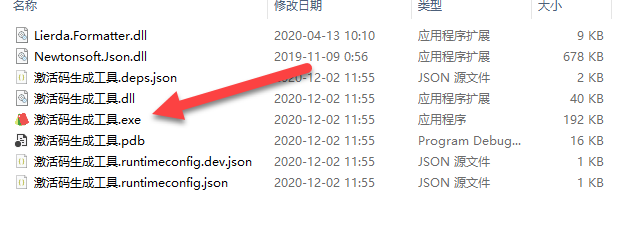
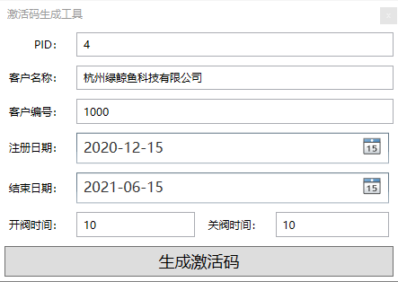

============
安装
============

客户端安装
-----------

许可证工具使用
~~~~~~~~~~~~~~~

解压许可证授权工具后，你将得到如下文件

找到**激活码生成工具.exe** 打开，将弹出如下界面

    - align: center

参数介绍

+-------+--------+-------+
|参数名称|作用    |备注    |
+=======+========+=======+
|PID|客户代码，错误的PID可能导致卡片无法解密，系统会使用PID加密卡片，不同的客户对应不同的PID|表厂给水司分配的ID，不同水司不可互读|
+-------+--------+--------+

软件配置
~~~~~~~~~~~~~~~

数据库安装
------------

