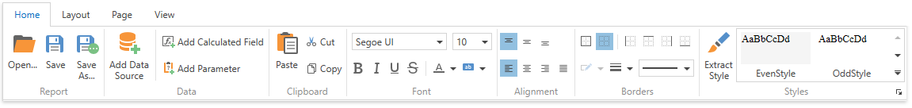
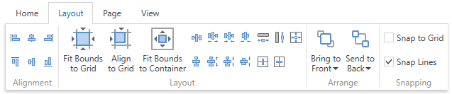
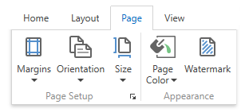
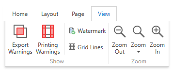
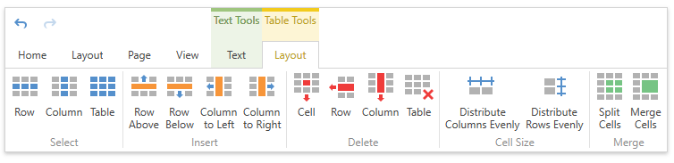

===========
报表设计器
===========

交互对象
-----------

工具栏
~~~~~~~~~~~~~~~

报表设计器工具栏包括常规命令的“主页”、“布局”、“页面”和“视图”选项卡，以及与所选报表控件相关的命令的上下文选项卡。

Home选项卡
^^^^^^^^^^^

使用此选项卡中的命令可以

    * 加载并保存报表布局；
    * 添加数据源、编辑计算字段和报表参数；
    * 删除选中的报表元素，放置到剪贴板上，粘贴到报表面板上；
    * 自定义字体、颜色、格式和对齐方式设置；
    * 基于选定控件的外观设置创建新样式，然后将创建的样式应用于其他控件。

Layout选项卡
^^^^^^^^^^^^^

使用此选项卡中的命令可以

    * 将报表元素彼此对齐或对齐网格；
    * 更改报表元素相对于其他报表元素的大小，以适应捕捉网格或父容器；
    * 更改堆叠元素的顺序；
    * 选择捕捉模式。

Page选项卡
^^^^^^^^^^^^^

使用此选项卡中的命令可以

    * 设置页边距、方向和纸张大小；
    * 指定页面的背景色；
    * 向报表添加水印文本或将图片转换为报表背景。

View选项卡
^^^^^^^^^^^^^

使用此选项卡可以

    * 打开/关闭导出和打印警告以突出显示相交控件和放置在页边距之外的控件；
    * 在设计图面上显示文档的水印。
    * 指定是否绘制捕捉栅格。

Contextual选项卡
^^^^^^^^^^^^^

每当您选择特定报表元素并提供适用于所选元素类型的命令时，上下文选项卡都是可见的。

下图演示了表单元格的可用选项卡：

文档预览
-----------

报表向导
-----------

数据源向导
-----------

本地化编辑器
--------------

