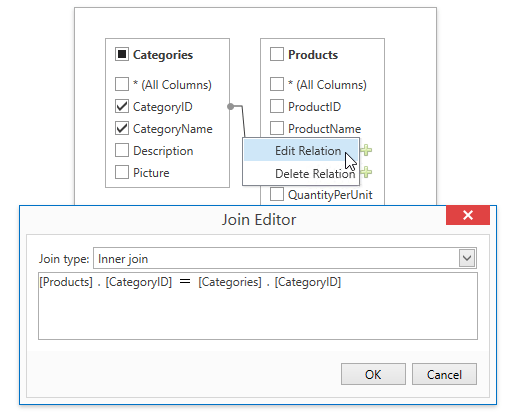

===============
报表设计器
===============

交互对象
-----------

工具栏
~~~~~~~~~~~~~~~

报表设计器工具栏包括常规命令的“主页”、“布局”、“页面”和“视图”选项卡，以及与所选报表控件相关的命令的上下文选项卡。

Home选项卡
^^^^^^^^^^^^^^^^

使用此选项卡中的命令可以

    * 加载并保存报表布局；
    * 添加数据源、编辑计算字段和报表参数；
    * 删除选中的报表元素，放置到剪贴板上，粘贴到报表面板上；
    * 自定义字体、颜色、格式和对齐方式设置；
    * 基于选定控件的外观设置创建新样式，然后将创建的样式应用于其他控件。

Layout选项卡
^^^^^^^^^^^^^^^^^^

使用此选项卡中的命令可以

    * 将报表元素彼此对齐或对齐网格；
    * 更改报表元素相对于其他报表元素的大小，以适应捕捉网格或父容器；
    * 更改堆叠元素的顺序；
    * 选择捕捉模式。

Page选项卡
^^^^^^^^^^^^^

.. figure:: img/tab3.png

使用此选项卡中的命令可以

    * 设置页边距、方向和纸张大小；
    * 指定页面的背景色；
    * 向报表添加水印文本或将图片转换为报表背景。

View选项卡
^^^^^^^^^^^^^

使用此选项卡可以

    * 打开/关闭导出和打印警告以突出显示相交控件和放置在页边距之外的控件；
    * 在设计图面上显示文档的水印。
    * 指定是否绘制捕捉栅格。

Contextual选项卡
^^^^^^^^^^^^^^^^^^^

每当您选择特定报表元素并提供适用于所选元素类型的命令时，上下文选项卡都是可见的。

下图演示了表单元格的可用选项卡：

.. figure:: img/tab5.png

控件工具箱
~~~~~~~~~~~~~~~

控件工具箱包含所有可用的报表控件，并允许最终用户将它们添加到正在编辑的报表中。报表控件可以显示不同种类的静态和动态信息（简单或格式化的文本、图片、表格等），还可以调整报表布局（在面板中组织控件，插入分页符等）。

若要了解如何从工具箱向报表添加控件，请参阅将控件添加到报表部分

General Content
^^^^^^^^^^^^^^^^^^^^^^

以下控件最常用于在报表中显示数据。

+---------------------------------+-------------------+---------------------------------------------------------------------------------------------------------------------------------------+
|图标                             |控件               |描述                                                                                                                                   |
+=================================+===================+=======================================================================================================================================+
|.. figure:: img/ico1.png         |Label              |最基本的Label控件用于在报表中显示纯文本。                                                                                              |
+---------------------------------+-------------------+---------------------------------------------------------------------------------------------------------------------------------------+
|.. figure:: img/ico2.png         |Check Box          |Check Box控件通过显示（或不显示）复选标记来显示报表中的True/False或Checked/Unchecked/Indeterminate状态，该复选框可以随附文本说明。     |
+---------------------------------+-------------------+---------------------------------------------------------------------------------------------------------------------------------------+
|.. figure:: img/ico3.png         |Rich Text          |富文本控件在报表中显示格式化文本。                                                                                                     |
+---------------------------------+-------------------+---------------------------------------------------------------------------------------------------------------------------------------+
|.. figure:: img/ico4.png         |Picture Box        |图片框显示报表中各种文件格式的静态或动态图像。                                                                                         |
+---------------------------------+-------------------+---------------------------------------------------------------------------------------------------------------------------------------+
|.. figure:: img/ico5.png         |Table              |Table控件用于在报表中显示表格信息。                                                                                                    |
+---------------------------------+-------------------+---------------------------------------------------------------------------------------------------------------------------------------+
|.. figure:: img/ico7.png         |Character Comb     |字符梳控件显示文本，以便在单个单元格中打印每个字符。                                                                                   |
+---------------------------------+-------------------+---------------------------------------------------------------------------------------------------------------------------------------+
|.. figure:: img/ico8.png         |Bar Code           |条形码控件将其内容转换为指定类型的条形码。                                                                                             |
+---------------------------------+-------------------+---------------------------------------------------------------------------------------------------------------------------------------+
|.. figure:: img/ico9.png         |Zip Code           |Zip Code控件将其内容转换为邮政编码。                                                                                                   |
+---------------------------------+-------------------+---------------------------------------------------------------------------------------------------------------------------------------+
|.. figure:: img/ico6.png         |Gauge              |仪表控件提供将图形仪表嵌入报表的功能。                                                                                                 |
+---------------------------------+-------------------+---------------------------------------------------------------------------------------------------------------------------------------+

Extended Data
^^^^^^^^^^^^^^^^^^^^^^

以下控件单独连接到数据，而不访问报表的数据源。

+------------------------------+---------------+---------------------------------------------------------------------+
|图标                          |控件           |描述                                                                 |
+==============================+===============+=====================================================================+
|.. figure:: img/ico11.png     |Chart          |图表控件使用多种二维或三维图表类型显示一系列点。                     |
+------------------------------+---------------+---------------------------------------------------------------------+
|.. figure:: img/ico12.png     |Sparkline      |迷你图控件显示一个紧凑的图表，通常用于反映报表中每一行的数据流。     |
+------------------------------+---------------+---------------------------------------------------------------------+
|.. figure:: img/ico13.png     |Pivot Grid     |透视网格控件以交叉表格形式显示动态数据。                             |
+------------------------------+---------------+---------------------------------------------------------------------+

Report Layout
^^^^^^^^^^^^^^^^^^^^^^

以下控件允许您在报表中绘制形状并自定义报表布局。

+------------------------------+--------------------+------------------------------------------------------------------------------------------------------------------------------+
|图标                          |控件                |描述                                                                                                                          |
+==============================+====================+==============================================================================================================================+
|.. figure:: img/ico21.png     |Panel               |Panel控件是一个容器，用于框定单独的报表控件，以便轻松地移动、复制和粘贴这些控件，并在报表预览中将它们可视化地合并在一起。     |
+------------------------------+--------------------+------------------------------------------------------------------------------------------------------------------------------+
|.. figure:: img/ico22.png     |Line                |线条控件绘制具有指定方向、样式、宽度和颜色的线。                                                                              |
+------------------------------+--------------------+------------------------------------------------------------------------------------------------------------------------------+
|.. figure:: img/ico23.png     |Shape               |形状控件绘制一个预定义的图形对象（矩形、椭圆等）                                                                              |
+------------------------------+--------------------+------------------------------------------------------------------------------------------------------------------------------+
|.. figure:: img/ico24.png     |Subreport           |子报表控件允许您在当前报表中包括其他报表。                                                                                    |
+------------------------------+--------------------+------------------------------------------------------------------------------------------------------------------------------+
|.. figure:: img/ico25.png     |Page Break          |分页符控件在报表中的任意点插入页分隔符。                                                                                      |
+------------------------------+--------------------+------------------------------------------------------------------------------------------------------------------------------+
|.. figure:: img/ico26.png     |Cross-Band Line     |Cross band Line控件在多个带区之间绘制一条线。                                                                                 |
+------------------------------+--------------------+------------------------------------------------------------------------------------------------------------------------------+
|.. figure:: img/ico27.png     |Cross-Band Box      |交叉带框控件通过多个带区绘制矩形                                                                                              |
+------------------------------+--------------------+------------------------------------------------------------------------------------------------------------------------------+

Document Statistics
^^^^^^^^^^^^^^^^^^^^^^^^^^^^

以下控件的动态内容不是从数据源获取的。

+------------------------------+----------------------+--------------------------------------------------------------------------------+
|图标                          |控件                  |描述                                                                            |
+==============================+======================+================================================================================+
|.. figure:: img/ico28.png     |Page Info             |Page Info控件用于向报表中添加页码和系统信息（当前日期和时间或当前用户名）。     |
+------------------------------+----------------------+--------------------------------------------------------------------------------+
|.. figure:: img/ico29.png     |Table of Contents     |“目录”控件根据为报表元素指定的书签生成目录。                                  |
+------------------------------+----------------------+--------------------------------------------------------------------------------+

Add Controls to a Report
^^^^^^^^^^^^^^^^^^^^^^^^^^^^^^^^^

要将工具箱中的控件添加到报表中，请执行下列操作之一。

    * 双击工具箱中的某个项以在默认位置创建相应的控件。
    * 将工具箱中的项拖放到报表中所需的位置。 

    .. figure:: img/ico30.png

    * 在工具箱中选择一个项，然后按住鼠标左键来指示边框。

    .. figure:: img/ico31.png
    
..  note::
        - 如果需要执行选择、重新排列或调整大小操作，请选择指针项

字段列表
~~~~~~~~~~~~~~~

“字段列表”面板允许您浏览和管理报表数据源、计算字段和参数，以及创建具有数据演示功能的报表控件。

管理数据源
^^^^^^^^^^^^^^

字段列表显示可用的报表数据源及其结构。可以右键单击数据源以访问其设置。

创建绑定报表元素
^^^^^^^^^^^^^^^^^^^

可以使用字段列表创建新的绑定报表控件，并将现有控件绑定到数据。

    * 将所需的字段项从字段列表拖到报表栏上，以创建绑定到此字段的新的适当报表控件。

    .. figure:: img/tool3.png

    * 字段列表允许您在按住CTRL或SHIFT键的同时单击多个数据字段来选择它们。将它们放到报表中以创建一个表，其中单元格绑定到相应的数据字段。

    .. figure:: img/tool4.png

    * 通过单击字段列表中的必需数据字段c并将其放到该控件上，可以将现有报表控件绑定到数据。

    .. figure:: img/tool5.png

管理计算字段
^^^^^^^^^^^^^^^^^^

字段列表允许您通过基于数据字段值、报表参数值等构建表达式来创建计算字段。
右键单击数据成员节点内的任何项，然后在调用的上下文菜单中选择添加计算字段。

可以选择已创建的计算字段，然后转到“属性”面板以编辑字段设置。或者，在计算字段上单击鼠标右键，然后使用关联菜单中提供的命令。

管理报表参数
^^^^^^^^^^^^^^^^

字段列表显示现有报表参数，并允许您向报表添加新参数。

通过右键单击“参数”节点或其任何子节点并选择“添加参数”，可以创建新参数。

报表浏览器
~~~~~~~~~~~~~~~

报表Gallery
~~~~~~~~~~~~~~~

分组排序面板
~~~~~~~~~~~~~~~

属性窗口
~~~~~~~~~~~~~~~

设计界面
~~~~~~~~~~~~~~~

脚本编辑器
~~~~~~~~~~~~~~~

查询编辑器
~~~~~~~~~~~~~~~

运行查询编辑器
^^^^^^^^^^^^^^^^^^^^^

查询生成器提供了一个可视化界面，用于构造用于访问SqlDataSource表和视图的SQL查询。

..  note::
    - 查询生成器不可用于对象、实体框架和Excel数据源。

创建新的数据绑定报表或将现有报表绑定到SQL数据源时，可以从报表向导的查询自定义页调用查询生成器。在此页面上，单击查询类别的wpfreport wizard create query page plus按钮，使用查询生成器创建新查询。

.. figure:: img/rpt3.png

如果使用旧版本的报表向导，则“查询自定义”页允许您创建单个查询。在这种情况下，选择Query选项以指定要构造SQL查询，然后单击runquerybuilder按钮。

还可以使用查询生成器向现有SQL数据源添加查询，以及编辑现有查询。右键单击报表资源管理器中的数据源，然后在上下文菜单中选择“管理查询”。

在“调用的管理查询”对话框中，单击“添加”以添加新查询。单击现有查询的省略号按钮可对其进行编辑。

然后，单击调用的数据源向导中的“运行查询生成器”按钮。

选择表
^^^^^^^^^^^^^^

通过将左侧可用表列表中的相应项拖到中心区域，可以将特定数据表或视图添加到查询中。

为要包含在查询结果集中的表字段启用复选框。

每个表都提供了一个上下文菜单，允许您重命名表或将其从查询中删除。

单击左侧的表列表并开始键入以搜索特定的表或视图。

添加表
^^^^^^^^^^^^^^

可以在同一个查询中联接多个表。查询生成器会自动突出显示与以前添加的表相关的表。以与主表相同的方式拖放从属表，以将其包含在查询中，并根据键列自动创建内部联接关系。

连接表的另一种方法是单击与键列对应的行中的QueryBuilderPlusButton按钮。

通过右键单击关系图上的关系并在调用的上下文菜单中选择“编辑关系”，可以自定义关系。使用联接编辑器选择联接类型（左外部或内部）、应用逻辑运算符（等于、小于等）和列键字段。

左-外联接返回内部联接中的所有值以及“左”表中与“右”表不匹配的所有值，包括键字段中具有空（空）值的行。

如果表在数据库级别没有关系，则可以手动联接这些表。在这种情况下，当您将表拖放到表列表中时，会自动调用联接编辑器，允许您构造自定义联接关系。
执行查询后，它返回一个“平面”表，该表由根据指定的联接选项选择的数据记录组成。

..  note::
    - 虽然在某些情况下，可能需要在单个查询中联接不同的表，但创建分层数据源可获得更好的性能（生成主明细报表的速度比通过分组“平面”数据源创建的类似报表更快）。

编辑参数
^^^^^^^^^^^^^^

单击“编辑参数”按钮可调用“查询参数”对话框，该对话框允许您添加和删除查询参数以及指定参数设置。

以下属性可用于每个查询参数：

    * **名称** -指定用于引用参数的名称。
    * **类型**-指定参数值的数据类型。
    * **表达式**-确定实际参数值是静态的还是动态生成的。
    * **Value**-指定查询参数的实际值。如果启用了“表达式”选项，则通过计算关联的表达式动态生成参数值，这在需要将查询参数值映射到报表参数值时非常有用。

然后，可以在“配置查询参数向导”页面上找到创建的参数。
有关查询参数的常规信息，请参见查询参数

过滤数据
^^^^^^^^^^^^^^

单击筛选器...按钮指定筛选条件。这将调用提供以下功能的过滤器编辑器：

    * **过滤器选项卡**
    编辑器包含Filter选项卡，允许您为结果数据指定筛选条件。过滤条件可以指定查询参数，也可以绑定到报表参数。
    
    * **组筛选器选项卡**
    “组筛选器”选项卡允许您为分组和聚合数据指定筛选条件。如果数据未分组，第二个选项卡将被禁用。

    * **其他选项**
    您可以限制结果数据行的数量。如果对数据进行排序，还可以指定在检索指定行数之前要跳过的行数。

..  note::
    - 根据选定的数据提供程序，可能无法考虑特定于提供程序的SQL字符串中的跳过设置。

另一个选项允许您只在结果集中包含不同的值。

形状数据
^^^^^^^^^^^^^^

查询生成器在数据源编辑器下显示列列表，该编辑器提供各种形状选项。

    * **列**
    指定选定列。
    可以从下拉列表中选择列，也可以通过单击相应列的省略号按钮来创建列表达式。

    .. figure:: img/rpt16.png

    * **表**
    指定包含选定列的表。
    此选项指示（所有表）是否为相应列指定了表达式。
    
    * **别名**
    指定自定义列名（别名）。
    此选项仅适用于查询中包含的列。

    * **输出**
    指定列是否包含在查询的结果集中。

    * **排序类型**
    指定是保留列中的原始数据记录顺序，还是对它们进行排序（升序还是降序）。

    .. note::
        - 当绑定到XML文件时，查询生成器不支持按聚合函数排序、DISTINCT和SELECT ALL语句以及自定义SQL。
    
    * **排序顺序**
    对数据列记录应用排序后，此选项可用。
    它定义了排序应用于多个列的优先级（此数字越小，优先级越高）。
    例如，如果列A的排序顺序设置为1，而列B的排序顺序设置为2，则查询将首先按A列排序，然后按B列排序。
    更改一列的此设置会自动更新其他列的排序顺序，以避免优先级冲突。

    * **分组依据**
    指定查询的结果集是否应按此列分组。

    * **聚合**
    指定是否应聚合列的数据记录。
    支持以下聚合函数：
        - Count 
        - Max 
        - Min 
        - Avg 
        - Sum 
        - Count Distinct 
        - Avg Distinct 
        - Sum Distinct 

将这些函数中的任何一个应用于列会丢弃查询结果集中的单个数据记录，而查询结果集中只包含聚合函数result

..  note::
    - 您应该将聚合/分组应用于所有列，或者不应用于任何列。

自定义SQL语句编辑
^^^^^^^^^^^^^^^^^^^^^^^^^

如果启用了自定义SQL编辑，则查询生成器将包含“允许编辑SQL”复选框。选择此选项将禁用查询生成器的可视化功能，并允许用户手动指定自定义SQL字符串。

..  important::
    - 在报表设计器中启用自定义SQL会使数据库面临可能的SQL注入风险。自定义SQL查询在执行之前未进行验证，并且可能包含潜在的有害指令。有关详细信息，请参阅数据访问安全性。

预览结果
^^^^^^^^^^^^^^^^^^

通过单击“预览结果”按钮，可以以表格数据示例的形式预览查询执行结果。
这将打开“数据预览”窗口，显示仅限于前1000个数据记录的查询结果集。

轻量查询构建器
^^^^^^^^^^^^^^^^^^

查询生成器轻模式允许您为表和列指定自定义名称。查询生成器不显示结果SQL查询，并在此模式下禁用列表达式，因为这些选项使用实际的数据成员名称

文档预览
-----------

通过切换到“打印预览”选项卡，可以预览报表设计器中当前打开的报表。这将显示由数据填充并划分为多个页面的报告。

在预览模式下，您可以自定义文档、导出为不同的第三方格式、通过电子邮件发送或打印。

文档预览提供了一个工具栏和面板，这些工具栏和面板根据文档内容而变得可用。有关详细信息，请参见文档查看器GUI。

报表向导
-----------

选择报表类型
^^^^^^^^^^^^^^^^^^

空报表
^^^^^^^^^^^^^^^^^^

表格报表
^^^^^^^^^^^^^^^^^^

模板报表
^^^^^^^^^^^^^^^^^^

标签报表
^^^^^^^^^^^^^^^^^^

数据源向导
-----------

连接到数据库
^^^^^^^^^^^^^^^

连接到EF数据源
^^^^^^^^^^^^^^^^^^

连接到Object对象数据源
^^^^^^^^^^^^^^^^^^^^^^^^^^^^^

连接到EXCEL数据源
^^^^^^^^^^^^^^^^^^^^^^^^^^^^^

连接到JSON数据源
^^^^^^^^^^^^^^^^^^^^^^^^^^^^^

连接到XPO数据源
^^^^^^^^^^^^^^^^^^^^^^^^^^^^^

本地化编辑器
--------------

本地化编辑器允许您更改报表中所有控件的可本地化文本属性的文本。

左侧面板允许您更改报表的语言或添加新语言以开始本地化。右侧面板包含一个网格，其中显示属性名称、以默认语言为该属性指定的文本以及所选语言的文本。所选语言的文本字符串是可编辑的。

打开本地化编辑器
^^^^^^^^^^^^^^^^^^

使用以下操作之一

    * 切换到“视图”功能区选项卡。单击本地化组中的对话框启动器

    .. figure:: img/wz2.png

    * 单击“属性”窗口中本地化属性旁边的省略号（…）按钮。

    .. figure:: img/wz3.png

使用本地化编辑器
^^^^^^^^^^^^^^^^^^

    * 要添加新语言，请单击右侧面板上的加号按钮。新语言的所有值都设置为默认语言的值。

    * 更改文本并单击“确定”按钮关闭编辑器并应用更改。

..  tip::
    - 调用本地化编辑器时，右侧面板中的网格将显示报表控件的文本属性的值。您可以单击属性列标题中的筛选器图标来修改筛选器并选择其他属性，或者清除筛选器以显示所有文本属性。