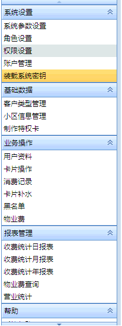
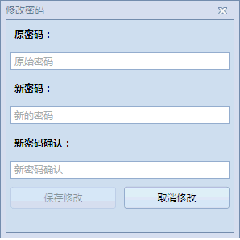

========
客户端使用方法
========

系统设置
-----------

装载许可证文件
~~~~~~~~~~~~~~~

权限设置
~~~~~~~~~~~~~~~

1.角色权限分配前需要系统中先存在对应的登陆角色角色设置,只有有了对应的角色才能有权限。
2.当系统中存在一个及一个以上登陆角色时设置角色权限才有意义。

.. figure:: img/right.png

.. note::
    - 请不要修改系统管理员的权限，这样可以避免因为误操作而导致权限管理界面不可用。
    - 当系统新增功能后需要手动为登陆角色分配权限。此操作会影响所有为当前登录角色的登录用户

新增的角色类型的权限默认为空。如果未分配权限，用户登入系统后界面将是一片空白。

.. figure:: img/right2.png

当权限被勾选后左侧 导航列表才会有其对应菜单。

..  note::
     - 注意：一些二级权限勾选后会在所在界面内部显示

角色设置
~~~~~~~~~~~~~~~

角色设置，也就是登录用户的类型，预付费水表管理系统根据用户类型的不同，会设置不同的使用权限，不同的权限，相应用户的用户登录后界面也会有所差异。

.. figure:: img/role.png

..  note::
      - 登录角色一旦创建后将不可删除，仅支持修改登录角色名称。

添加登陆类型
^^^^^^^^^^^^^^^

添加登陆类型时登陆类别和登陆名称建议使用同一名称。

.. note::

    - 不同版本的系统UI界面可能会有所不同
    
.. figure:: img/role1.png

账户管理
~~~~~~~~~~~~~~~

用户管理便是对实际登陆系统的用户的管理。

包含:新增账号、编辑账号、删除账号、重置密码

账号管理之前，请确保您已包含至少一个登陆角色。角色设置

账号登陆后一片空白，或者不存在想要的菜单，请先配置权限权限设置

新增账号
^^^^^^^^^^^^^^^

登陆账号：用户在登陆界面提供的账号。

登陆昵称：用户的名称或者昵称。（打印票据、发票时会调用）

账号类型：为用户分配的登录角色。角色设置

.. note::

    - 新增的登陆账号密码"12345678"
 
编辑账号
^^^^^^^^^^^^^^^

编辑账号请右键选择对应的账号单击右键即可。

当账户类型错误时可通过修改账户类型修改。

删除账号
^^^^^^^^^^^^^^^

不建议删除账号。删除账号可能导致某些数据丢失会查询不到。

此功能仅建议在初期测试时使用。

重置密码
^^^^^^^^^^^^^^^

重置密码后，登录密码将被重置为"12345678"

系统参数设置
-----------

系统参数设置
~~~~~~~~~~~~~~~

系统参数设置可配的信息有 串口的端口名称，水表的类型（旧卡小口径水表或新卡大小口径水表）

.. note::
    - 不同的水表类型 将会出现不同的界面，请务必确认水表类型正确。
    - 如果选择错了水表类型 则会导致卡片不可读写

打印组件配置

我们支持的打印方式有

    * 不打印
    * 默认打印方式
    * 重庆市的打印方式
    * 增强型发票打印方式

在使用前 请记得配置好您要使用的打印方式。

驱动下载
~~~~~~~~~~~~~~~

由于系统使用了Silicon Labs CP210x USB to UART Bridge 读卡器。所以在使用前我们需要先为客户端安装好对应的读卡器驱动。

读卡器支持列表

  * Windows Xp
  * Windows 7
  * Windows 8/8.1
  * Windows 10

我们已在软件中内嵌了 Xp、Win7和Win10的

如果这些还不足以满足您的电脑,您可以去官网下载最新的驱动。

下载地址:https://cn.silabs.com/developers/usb-to-uart-bridge-vcp-drivers

..  note::
      - 由于silabs 官网可能频繁变动，我们无法保证此链接永久可用

基础数据
--------

客户类型管理
~~~~~~~~~~~~~~~

根据卡片类型的不同，对应的价格参数也是不同的，针对不同类型的用户指定的收费策略也是不同的。详细信息请看阶梯水价

..  note::
     - 客户类型编辑之前请先加载系统版本读写卡模块

**具体说明**
  
  假设 额定用量1为44m³，额定用量2为75m³；一级单价1.2元;二级单价1.5元;三级单价2.0元时;

+--------+--------+
|用量    |单价    |
+========+========+
|20      |1.2     |
+--------+--------+
|30      |1.2     |
+--------+--------+
|40      |1.2     |
+--------+--------+
|50      |1.5     |
+--------+--------+
|60      |1.5     |
+--------+--------+
|70      |1.5     |
+--------+--------+
|80      |2.0     |
+--------+--------+
|90      |2.0     |
+--------+--------+
|100     |2.0     |
+--------+--------+

对应的设置结果如下图

则其对用的阶梯价梯图为

当用户用水量为30m³时，则实际需缴纳费用为30*1.2=3.6元;

当用户用水量为120m³时，则实际需缴纳费用为

44*1.2+70*1.5+10*2.0=45.2+105+20=170.2元

..  note::
      - 三级单价>二级单价>一级单价;其中，一级单价=排污费+水资源管理费+单价增量
      - 用户发卡时收取的费用为开户费用，而不是卡片费用，用户补卡时收取的费用为卡片费用

小区信息管理
~~~~~~~~~~~~~~~

小区是添加表具用户的必备条件，没有对应的小区信息是不能添加用户的。

+-------------+-----------------------------------------------+
|名称         |描述                                           |
+=============+===============================================+
|小区编号     |建议使用数值增量添加                           |
+-------------+-----------------------------------------------+
|小区名称     |显示出来的小区名称。开具发票时会调用此信息     |
+-------------+-----------------------------------------------+
|详细地址     |小区的详细地址，最好精确到街道级别             |
+-------------+-----------------------------------------------+
|状态信息     |无关项                                         |
+-------------+-----------------------------------------------+

 

状态信息不用管。

制作特权卡
~~~~~~~~~~~~~~~

制作设置卡
^^^^^^^^^^^^^^^

设置卡用于初始化表端参数，常见参数有预充值量、最大存量、最低消费量、量不足提示、透支门限、开阀时间、关阀时间等等。

阶梯价类型由读写卡模块决定。

..  note::
      - 当阶梯价类型为禁用时表示当前卡片类型不支持设置阶梯价类型

制作时间卡
^^^^^^^^^^^^^^^

时间卡可以更新表中的时间。
时间卡是为了更正系统时间及日期而设置的，刷时间卡不受其它卡的限制。刷时间卡液晶上会显示相应提示符，然后依次显示时间、日期。
如果刷卡不正常出现错误提示信息，请参看表错误提示信息表端错误提示。

制作基表卡
^^^^^^^^^^^^^^^

基表卡是用来修改表端ID号码的，表端ID号码修改后，可能需要重新发卡。

制作修正卡
^^^^^^^^^^^^^^^

修正卡是为了校正模块的累计量（和机械表头累计量一致）而设置的，刷修正卡后

上图为刷修正卡提示符，下图 为显示校正后累计量

之后依次显示当月量，价格、日期， 然后进入休眠状态 

制作检测卡
^^^^^^^^^^^^^^^

阀门检测卡用于对基表阀门性能的检测，刷阀门检测卡后阀门会动作两次，例如，刷卡前，阀门为关，刷卡后，阀门开一次，关一次，刷卡前后阀门状态不变，阀门检测卡不受其它卡的限制。
刷阀门检测液晶显示如图所示，然后轮显剩余量、累计量、当月累计量， 日期、当前价格。然后进入休眠状态。

如果刷卡不正常出现错误提示信息，请参看表表端错误提示 

制作恢复卡
^^^^^^^^^^^^^^^

恢复卡作用将表系统恢复成出厂裸表状态,刷恢复卡依次显示如图

然后进入休眠状态。如果刷卡不正常出现错误提示信息，请参看表表端错误提示 

制作管理卡
^^^^^^^^^^^^^^^

管理卡是在已开户或已刷测试卡前提下，刷管理卡才可以被系统识别，刷管理卡液晶显示如下图

刷管理卡后，阀门因异常关阀，在异常清除后，阀门开阀，液晶显示如下图 

然后依次显示图 

然后进入休眠状态。如果刷卡不正常出现错误提示信息，请参看表表端错误提示

制作换表卡
^^^^^^^^^^^^^^^

如果需要更换水表,那么需要利用换表卡将旧表的数据从旧表中换出,然后将数据换到新表中,被换出数据的旧表需恢复卡恢复成裸表。
当数据从旧表中换出后,液晶出现下图界面

然后依次显示下图 。 

..  note::
      - 如果新表还未开户,然后刷已经换入数据的换表卡,液晶显示如图 
      - .. figure:: img/exchange2.png

如果刷卡不正常出现错误提示信息，请参看表表端错误提示。 

卡片清除
^^^^^^^^^^^^^^^

清除卡片前清先加载读写卡模块读写卡模块
清除卡片会将卡片内的数据块清零，并将卡片设置为空白卡。
清除后的卡片如下图

.. note::
    - 清除卡片前您擦除的卡片必须为T5557卡片；卡片内的PID必须和预付费水表管理系统一致，且读写卡模块必须和卡片类型匹配方可操作。.

卡片读取
^^^^^^^^^^^^^^^

将卡片内的数据读取到预付费水表管理系统中

.. note::
    - 清除卡片前您擦除的卡片必须为T5557卡片；卡片内的PID可以和系统不一致，PID不一致只可读不可写.

业务操作
--------

卡片操作
~~~~~~~~~~~~~~~

卡片操作是用来为给卡片充值的页面，此处卡片类型必须为用户卡。

.. note::
    - 由于卡片是金额表，所以此处我们写入的数据全部为金额数据
    - 虽然上面的界面显示有按流量充值，但是由于金额表实际可用流量和用户使用习惯相关，这里显示的按量充值仅表示如果用户按照 阶梯单价1 使用时所购得的流量。

消费记录
~~~~~~~~~~~~~~~

消费记录了所有设计到金钱的操作（卡片补水、换表补水等不含）,消费记录信息最终将在您的收费统计报表中体现。

..  note::
      - 作废了的单据将不会被报表统计。

生成报表（导出全部记录、打印凭据报表）功能是将当前界面中显示的数据，以指定的格式在输出
打印凭据报表界面如下：

导出全部记录和打印凭据报表的区别仅是将输出结果以xlsx格式导出。
导出所有记录也是导出为了xlsx格式，和导出全部记录的区别在于导出所有记录尾部会有数据汇总。
如图

..  note::
      - 注意：导出的数据会受搜索框的影响。

卡片补水
~~~~~~~~~~~~~~~

卡片补水只能操作用户卡，如果您操作的不是用户卡，将不能进行此项操作。
补水操作会直接修改购买量为指定数值。
卡片补水不会产生交易信息，故而此操作只有当操作错误后方可使用。

黑名单
~~~~~~~~~~~~~~~

黑名单用于记录用户缴纳物业费情况，当未充值天数>=0时，表示此时改用户需要缴纳物业费了。
当未充值天数 小于0，则表示 改用户已经充值，且距离下次缴纳物业费还有多少天。

物业费
~~~~~~~~~~~~~~~

当用户设置了物业信息后（填好房屋面积，物业单价，单元房号）后用户资料，就可以为该用户缴纳物业费了
收费类型可分为固定收费（不区分房屋面积）和按面积收费

**固定收费计算公式**

  计算公式: 物业费=月数*单价

..  note::
      - 固定收费下仅需要填写用户的单价、房屋面积可为空.

**按面积收费计算公式**

  计算公式: 物业费=月数*单价*面积

..  note::
      - 按面积收费下房屋面积和单价均需要填写。

单击缴费后会弹出缴费确认对话框，单击Yes后，弹出 打印发票对话框

报表格式不合适可去报表设计界面设计报表报表设计器

用户资料
~~~~~~~~~~~~~~~
用户资料管理
^^^^^^^^^^^^^^^

用户资料包含了基本用户资料信息和物业信息两部分。
基本用户资料信息是为了记录用户个人的姓名、身份证号码、联系电话、等级日期、发卡状态等；
物业信息是为了售水公司收取物业费而设置，包含的信息有，所在小区、房屋面积、物业费单价、单元房号、缴费开始日期和缴费截至日期。

+-------------+--------------------------------------------------------------------------------------------------------+
|名称         |作用                                                                                                    |
+=============+========================================================================================================+
|所在小区     |用户所在小区名称                                                                                        |
+-------------+--------------------------------------------------------------------------------------------------------+
|房屋面积     |当物业费是按面积收费时此项必须填                                                                        |
+-------------+--------------------------------------------------------------------------------------------------------+
|物业单价     |物业费的单位价格。当是固定收费模式时，物业费=月份总数*单价；当是按面积收费时，物业费=月数*单价*面积     |
+-------------+--------------------------------------------------------------------------------------------------------+
|单元房号     |用户所在单元房间号，例如13#425                                                                          |
+-------------+--------------------------------------------------------------------------------------------------------+
|缴费开始     |记录用户缴费的开始日期。重复缴纳物业费该值为第一次缴纳物业费的时间                                      |
+-------------+--------------------------------------------------------------------------------------------------------+
|缴费截至     |记录物业费到期日。当缴费截至日期小于当前日期，黑名单未充值天数将X号表示。黑名单                         |
+-------------+--------------------------------------------------------------------------------------------------------+

如图

.. figure:: img/user2.png

用户信息的单个新增修改和删除这里不再介绍

导入导出用户数据
^^^^^^^^^^^^^^^

* 批量导入用户资料前您需要将导入模板先导出

* 然后按照Excel 样式填好对应的数据

填入完毕后，单击“导入数据”，找到导入模板。
然后会启动批量导入用户信息向导。
如下图

指定好“所在小区”，“用户类型”，并检查全部通过后，单击保存即可。

..  note::
      - 注意：如果检查清空为“未通过”，表示这个射频卡号码已经在系统中注册

换表补卡
^^^^^^^^^^^^^^^

换表补水顾名思义是指指定用户的射频卡片还能使用，但是要替换水表。
换表补水可能手动设置充值次数和购买量。

补卡
^^^^^^^^^^^^^^^

补卡的意识就是之前您发过卡，卡片可能是因为破损、消磁或其他原因导致不能再使用。
发卡会收取卡片费用。卡片费用是在客户类型管理里面定义的
发卡时您需要先配置好读卡器模块读写卡模块 ,然后准备一张卡片的卡片（空白卡）并放置于读卡器上即可。
发片票据预览界面如下：

..  note::
      - 发卡时会将系统内记录的交易次数写入卡片。如果交易次数小于实际交易次数、您可以尝试使用卡片补水功能修正

发卡
^^^^^^^^^^^^^^^

添加完成用户后用户信息仅仅是填入了系统，并不包含对应的卡片信息。
新增的用户发卡状态为“未发卡”

此时您只能对该用户做发卡处理；
发卡时会收取开户费用。开户费用是在客户类型管理定义的。客户类型管理
发卡时您需要先配置好读卡器模块读写卡模块 ,然后准备一张卡片的卡片（空白卡）并放置于读卡器上即可。
发片票据预览界面如下：

发卡完成后，消费记录会新增一条对应的收费项目

..  note::
      - 发卡后交易次数为0，此时您需要为该卡片充值。

报表管理
--------

收费统计日报表
~~~~~~~~~~~~~~~

收费统计日报表是对消费记录按日的汇总分析。依据收费项目、操作员进行了分组。

..  note::
      - 用户信息、小区信息、客户类型、登录账户等信息被删除后可能导致查询信息不完整

首次载入界面显示的是所有日报表信息，通过选择对应的日期从而再次筛选数据。

单击导出记录则将当前显示界面的数据导出为xlsx文件。
导出后样式如下:

单击打印数据则启动打印窗口开始打印数据，界面如下：

收费统计月报表
~~~~~~~~~~~~~~~

收费统计月报表是对消费记录按月的汇总分析。依据收费项目、操作员进行了分组。
首次载入界面显示的是所有月报表信息，通过选择对应的日期从而再次筛选数据。

..  note::
      - 用户信息、小区信息、客户类型、登录账户等信息被删除后可能导致查询信息不完整.

单击导出记录则将当前显示界面的数据导出为xlsx文件。
导出后样式如下:

单击打印数据则启动打印窗口开始打印数据，界面如下：

收费统计年报表
~~~~~~~~~~~~~~~

收费统计年报表操作方式一样，区别在于年报表是按照年份来分组的。
操作可参考月报表

物业费查询
~~~~~~~~~~~~~~~

物业费查询依赖于用户资料下的物业信息用户资料、黑名单以及物业费缴费模块物业费;
当指定卡号有了缴费记录后，将查询出缴费结果

单击导出记录，则系统将数据导出为xlsx文件。
样式如下:

单击打印报表则启动打印对话框。
如图：

营业统计
~~~~~~~~~~~~~~~

营业统计是值按照登录角色对营业数据的分析。您可以按照时间段和登录角色分析出报表信息。

单击导出记录，则将数据导出为xlsx文件。
样式如下：

单击打印记录，启动打印对话框，样式如下：

超级报表
~~~~~~~~~~~~~~~

超级报表1
~~~~~~~~~~~~~~~

其他
--------

报表设计器
~~~~~~~~~~~~~~~

编写中...

  小伙子别急..

修改密码
~~~~~~~~~~~~~~~

新建的账号默认密码为

  12345678 

如要修改，请单击 **修改密码** 按钮

.. figure:: img/modify.png

..  note::
    - 修改后的密码长度至少需要6个字符

密码修改完成后系统将跳转到登录界面。

阶梯水价
~~~~~~~~~~~~~~~

  **阶梯水价** 是对使用自来水实行分类计量收费和超定额累进加价制的俗称。**阶梯水价** 充分发挥市场、价格因素在水资源配置、水需求调节等方面的作用，拓展了水价上调的空间，增强了企业和居民的节水意识，避免了水资源的浪费。阶梯式计量水价将水价分为两段或者多段，每一分段都有一个保持不变的单位水价，但是单位水价会随着耗水量分段而增加。

  **阶梯水价** 的基本特点是用水越多，水价越贵。例如有的城市将居民的生活用水水价设定两个水量的分界点，从而形成三种收费标准：用水15吨以内为人民币0．6元∕吨，15—20吨为1．4元∕吨，20吨以上为2．1元∕吨。缺水城市可实行高额累进加价制。

  早在2002年4月1日，中国国务院国家计委、财政部、建设部、水利部、国家环保总局就联合发出《关于进一步推进城市供水价格改革工作的通知》，要求进一步推进城市供水价格改革。《通知》要求全国各省辖市以上城市须在2003年底前实行阶梯水价，其他城市则在2005年底之前实行阶梯水价。

  2014年1月3日，国家发展改革委、住房城乡建设部出台“指导意见”，要求2015年底前，所有设市城市原则上全面实行居民阶梯水价制度。

表端错误提示
~~~~~~~~~~~~~~~

本系统中如果在卡操作过程出现错误,液晶会提示错误,LED 闪烁报警。

**错误表**

+-------+-------------+-------------------------------------------+
|#      |错误显示     |错误原因                                   |
+=======+=============+===========================================+
|1      |Error_01     |校验和出错                                 |
+-------+-------------+-------------------------------------------+
|2      |Error_03     |二级低压，不能进行卡操作                   |
+-------+-------------+-------------------------------------------+
|3      |Error_04     |未开户或未刷测试卡                         |
+-------+-------------+-------------------------------------------+
|4      |Error_05     |用户卡表号不对应                           |
+-------+-------------+-------------------------------------------+
|5      |Error_06     |提前拔卡                                   |
+-------+-------------+-------------------------------------------+
|6      |Error_07     |超出最大购买量                             |
+-------+-------------+-------------------------------------------+
|7      |Error_12     |刷卡过快或者不是本客户系统卡               |
+-------+-------------+-------------------------------------------+
|8      |Error_15     |卡片确认失败，线圈未连接好或有磁场干扰     |
+-------+-------------+-------------------------------------------+
|9      |Error_16     |阶梯价设置错误，不能为0                    |
+-------+-------------+-------------------------------------------+
|10     |Error_17     |换表卡二次换出时表号不对应                 |
+-------+-------------+-------------------------------------------+
|11     |Error_18     |充值不成功表端充值次数大于卡次数           |
+-------+-------------+-------------------------------------------+

